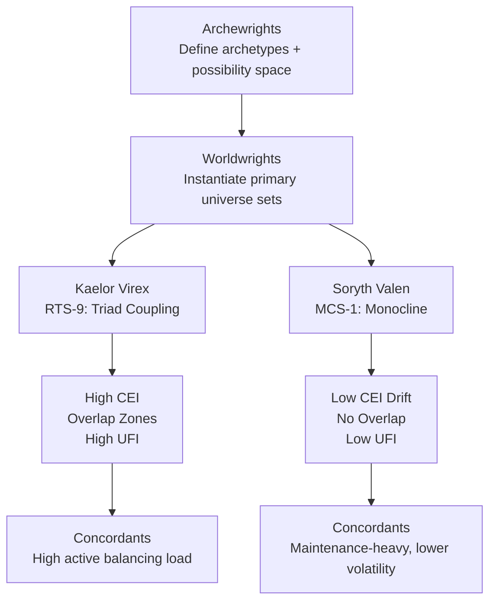

# Worldwright Design Philosophies

## Overview

Worldwrights create primary universe sets.
Different Worldwrights therefore shape not only local physics and civilizational constraints, but the long-range evolutionary behavior of reality itself.

Under the refined hierarchy:

- **Archewrights** define archetypes and possibility space,
- **Worldwrights** instantiate primary universe architectures,
- **Concordants** operate within those universes to maintain creative entropy balance (CEI).

This page compares two competing Worldwright designs:

1. **Kaelor Virex** — Resonant Triad System (RTS-9)
2. **Soryth Valen** — Monocline System (MCS-1)

---

## Section 1: Kaelor Virex — Resonant Triad System (RTS-9)

Kaelor Virex designed **RTS-9** as a three-universe coupled structure, where each primary universe remains distinct but dynamically resonant with the others.

### Core Profile

- three interacting universes,
- high baseline CEI,
- controlled overlap zones,
- strong seed mind generation capacity.

### Design Logic

RTS-9 treats novelty as a renewable systems property.
Cross-universe coupling creates phase offsets and cognitive gradient differentials that generate persistent unresolved futures.

### Key Concepts

- **Creative Entropy amplification** through managed resonance,
- **Universe coupling** with bounded transfer corridors,
- **Secondary universe emergence** as overlap interactions pass critical complexity thresholds.

### Operational Consequences

- high anomaly incidence,
- elevated Concordant intervention demand,
- substantial Levril monitoring presence around overlap boundaries,
- above-median UFI due to high-IWD population opportunities.

---

## Section 2: Soryth Valen — Monocline System (MCS-1)

Soryth Valen designed **MCS-1** around a single primary universe, **Axiom-Prime**, with strong deterministic constraint architecture.

### Core Profile

- single primary universe,
- deterministic structure,
- entropy dampening,
- no overlap zones.

### Design Logic

MCS-1 prioritizes continuity integrity and long-range predictability over open-ended novelty.
Its constraint layers suppress phase divergence and minimize branch proliferation.

### Key Concepts

- **stability-first design**,
- **minimal anomaly generation**,
- **low Universe Fertility Index (UFI)** due to constrained deep-divergence environments.

### Operational Consequences

- low systemic shock rates,
- reduced Concordant emergency workload,
- sparse Levril deployment in routine epochs,
- low seed-mind throughput despite high civilizational persistence.

---

## Section 3: Direct Comparison

| Dimension | Kaelor Virex (RTS-9) | Soryth Valen (MCS-1) |
|---|---|---|
| CEI behavior | High and oscillatory; sustained novelty throughput | Low-to-moderate and flattening; closure-resistant but innovation-thin |
| UFI (seed production) | High relative UFI via deep divergence and paradox exposure | Low UFI due to constrained interior complexity pathways |
| Stability vs novelty | Novelty-forward with managed instability | Stability-forward with managed stagnation |
| Concordant workload | Heavy in-universe balancing and anomaly mediation | Lower routine load; emphasis on long-cycle maintenance |
| Levril deployment | Dense at overlap zones and transfer corridors | Light, mostly archival audit and boundary assurance |

---

## Section 4: Cosmological Implications

High-CEI Worldwright systems tend to produce:

- anomaly clusters,
- overlap-derived hostile emergents (“monsters”),
- high volumes of seed-capable minds.

Low-CEI Worldwright systems tend to produce:

- durable civilizational continuity,
- low anomaly rates,
- stable but increasingly stagnant universes.

In lifecycle terms, RTS-9 delays predictive closure through active novelty circulation, while MCS-1 slows disruption at the cost of reduced evolutionary optionality.

---

## Section 5: Narrative Tension

The Virex–Valen divide is not merely technical; it is philosophical.

- Virex argues that reality must preserve possibility, even at the cost of hazard.
- Valen argues that continuity and survivability require aggressive suppression of runaway divergence.

Their dispute anchors an enduring question in Star Rangers cosmology:

> **Should universes prioritize stability or possibility?**

---

## Cross-Links

- [Seed Mind Lifecycle](/star-rangers/lore/seed-mind-lifecycle/)
- [Creative Entropy Framework](/star-rangers/lore/creative-entropy-framework/)
- [Noögenic Seeding System](/star-rangers/lore/noogenic-seeding-system/)
- [Canonical Glossary and Terminology Migration Guide](/star-rangers/lore/glossary/canonical-glossary-and-migration-guide/)

---

## Optional Diagram

